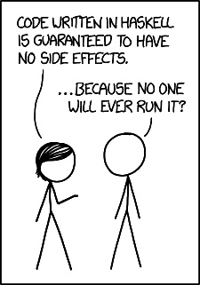

# Programmation Fonctionnelle

La forme de cette section est simple. Vous devez remplir les fonctions
demandées. Par la suite, il est possible d'exécuter les tests afin de vérifier
la validité de votre solution:

```shell
$ ghc *.hs && ./main
```

Il y a 5 questions allant de facile à difficile dans les fichiers
`question1.hs`, `question2.hs`, `question3.hs`, `question4.hs` et
`question5.hs`. Ne modifiez pas le fichier `main.hs`. De plus :

* Vous pouvez seulement utiliser les modules fournis de base dans
  [Haskell](https://hackage.haskell.org/package/base).
* Vous ne pouvez pas modifier la définition de fonction fournit.
* Vous pouvez créer vos propres sous fonctions si nécessaire.
* Vous ne pouvez pas hardcode les réponses des tests dans vos fonctions.
